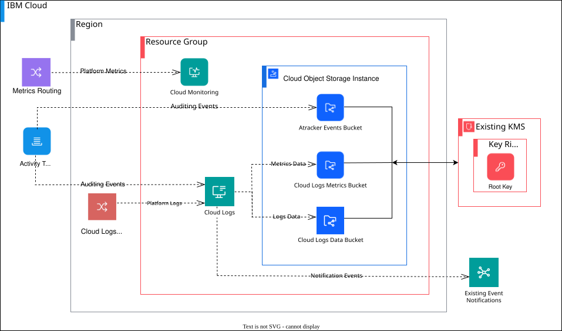

# IBM Cloud observability instances deployable architecture

## :warning: Deprecation notice:
This module has been deprecated and will be archived on the 15th April 2026. See the below steps on how to [migrate](#migration) to the replacement modules. [Learn more](https://terraform-ibm-modules.github.io/documentation/#/deprecation.md) about the official terraform-ibm-modules deprecation policy.

### Migration:
Please migrate to the following modules:
- [terraform-ibm-cloud-logs](https://github.com/terraform-ibm-modules/terraform-ibm-cloud-logs)
- [terraform-ibm-cloud-monitoring](https://github.com/terraform-ibm-modules/terraform-ibm-cloud-monitoring)
- [terraform-ibm-activity-tracker](https://github.com/terraform-ibm-modules/terraform-ibm-activity-tracker)

This deployable architecture creates observability instances in IBM Cloud and supports provisioning the following resources:

* A resource group, if one is not passed in.
* An IBM Cloud Monitoring instance.
* An IBM Cloud Logs instance.
* An IBM Cloud Object Storage instance, if one does not exist.
* The root keys in an existing key management service (KMS) if the keys do not exist. These keys are used when Object Storage buckets are created.
* A KMS-encrypted Object Storage bucket to store archived logs, if one is not passed in.
* A KMS-encrypted Object Storage bucket for Activity Tracker event routing, if one is not passed in. (Disabled by default as service is deprecated)
* A KMS-encrypted Object Storage bucket for Cloud Logs data, if one is not passed in.
* A KMS-encrypted Object Storage bucket for Cloud Logs metrics, if one is not passed in.
* An Activity Tracker event route to an Object Storage bucket and Cloud Logs target.
* An IBM Cloud Metric Routing, setting route to a Cloud Monitoring target.
* An option to integrate Cloud Logs with existing event notification instance.
* An option to configure Cloud logs policies (TCO Optimizer).

**Important:** Because this solution contains a provider configuration and is not compatible with the `for_each`, `count`, and `depends_on` arguments, do not call this solution from one or more other modules. For more information about how resources are associated with provider configurations with multiple modules, see [Providers Within Modules](https://developer.hashicorp.com/terraform/language/modules/develop/providers).
